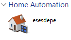

# esp32SSDP
SSDP for ESP32, including http updater without JQuery
based on https://github.com/esp8266/Arduino/issues/2283 
https://github.com/esp8266/Arduino/files/980894/SSDPDevice.zip
by Pawel Dino

Shows the ESP32 in Windows Network tab under Home Automation.

The example needs a ssid and password defined for the WiFi credentials see 
wifi_ss.h

Included httpupdater code that is independent of JQuery, and lacks
the overload of braces that confuse me.
 
